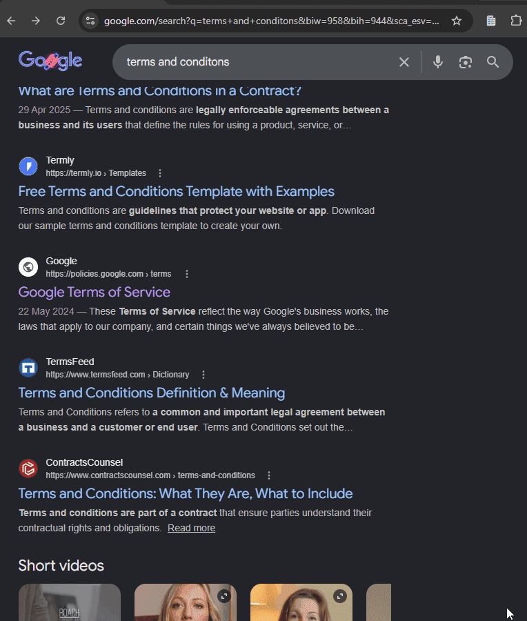

# Fine Print Decoder

> Open any Terms & Conditions or Privacy Policy — Gemini reads the fine print and flags what they don't want you to notice.



---

## What It Does

A Chrome extension that acts as your personal legal analyst. Navigate to any Terms & Conditions, Privacy Policy, or End User License Agreement page and click **Decode This Page**. Gemini reads the full text and returns:

- **Trust Score** — 0–100 rating with animated visual ring (0 = extremely harmful, 100 = completely safe)
- **Verdict** — Safe / Caution / Danger with a one-sentence explanation
- **🚩 Red Flags** — Clearly harmful or deceptive clauses you need to know about
- **⚠ Hidden Clauses** — Buried terms most users would never notice
- **📋 Plain Summary** — What you're actually agreeing to, in plain English

**Features:**
- 🔍 **Legal X-Ray UI** — Animated scan line loading, SVG score ring, staggered card entrance
- 📊 **Animated score counter** — Counts up from 0 to the final score on every analysis
- 🎨 **Color-coded verdict** — Red for Danger, Amber for Caution, Teal for Safe
- 🔄 **10-minute session cache** — Reopen the popup and your last result is instantly restored
- ⚙ **Settings panel** — Update or clear API keys at any time
- ☁ **OpenRouter fallback** — Automatically falls back to OpenRouter if Gemini quota is hit

---

## Getting Started

### Step 1 — Get a Gemini API Key (free)

1. Go to [aistudio.google.com/app/apikey](https://aistudio.google.com/app/apikey)
2. Click **Create API key**
3. Copy the key (starts with `AIza...`)

### Step 2 — Install the extension

1. Clone or download this repository
2. Open `chrome://extensions`
3. Enable **Developer mode** (top-right toggle)
4. Click **Load unpacked** → select the `fine-print-decoder` folder
5. Click the extension icon in the toolbar

### Step 3 — First launch

On first open, you'll see the onboarding screen:
1. Paste your **Gemini API Key** (or an OpenRouter key — either one works)
2. Click **Start Decoding →**
3. Navigate to any Terms & Conditions or Privacy Policy page
4. Click **Decode This Page**

---

## How to Use

1. Navigate to any website's **Terms of Service**, **Privacy Policy**, or **EULA** page
2. Click the Fine Print Decoder icon in your Chrome toolbar
3. Click **⚖ Decode This Page**
4. Watch the scan animation while Gemini reads the document
5. Review your **Trust Score**, **Verdict**, and color-coded insight cards
6. Click **📋 Copy** to copy the full analysis to your clipboard

**Tip:** Works best on pages with the actual policy text visible in the DOM. If a page loads content dynamically, scroll down first to trigger full load before decoding.

---

## Tech Stack

- **Gemini 3.5 Flash** — Structured JSON analysis via `generativelanguage.googleapis.com` (released Google I/O 2026)
- **OpenRouter** — Fallback chain with Gemini 2.5 Flash → DeepSeek → Llama 3.3
- **Manifest V3** — `chrome.scripting.executeScript` for page extraction (no persistent content script)
- **Vanilla JS** — Zero build step, zero dependencies
- **SVG Score Ring** — CSS + JS animated circle progress indicator
- **CSS Scan Animation** — Document scan line built entirely in CSS keyframes

---

## Architecture

```
popup.html  →  popup.js
                  ↓
          chrome.scripting.executeScript()
            → extracts page text (up to 12,000 chars)
                  ↓
          chrome.runtime.sendMessage (callGeminiBackground)
                  ↓
          background.js → Gemini 2.0 Flash
            → returns structured JSON:
               { score, verdict, verdict_reason,
                 red_flags[], hidden_clauses[], plain_summary[] }
                  ↓
          renderResult() → animateScore() + SVG ring + staggered cards
```

---

## Day 12/180

Part of my **[180-day Chrome extension challenge](https://x.com/happy_ships)** — shipping one extension every day.

IO Sprint #5 | Built for Google I/O 2026 | May 26, 2026
